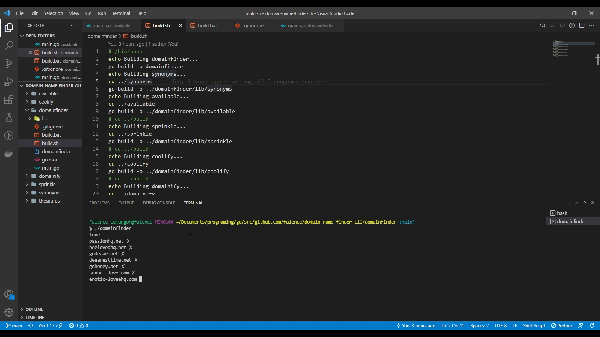

# Domain Name Finder CLI app
Learning Go by building a domain name finder application. 
This app has 5 sub-programs that are then run by the `./domainfinder` program.

### The 5 sub-programs
1. `Sprinkle`: adds web-friendly sprinkle words to add the chance of finding an available domain name.
2. `Domainify`: ensures that words are acceptable for a domain name by removing unacceptable characters.
3. `Coolify`: changes a boring normal word to a web 2.0 by fiddling around with vowels.
4. `Synonyms`: uses the Big Huge Thesaurus 3rd party API to find synonyms for words.
5. `Available`: uses the WHOIS server 3rd party API to check whether the domain is available.

### Things I learnt
- Standard streams and how to redirect standard input and standard output.
- Consuming JSON RESTful API web services in my code. I consumed the [Big Huge Thesaurus API](https://words.bighugelabs.com/site/api)
- Consuming non-HTTP APIs (e.g. TCP) in my code. I opened a connection to the WHOIS server and wrote data over raw TCP
- Using the `math/rand` standard package to get pseudo random numbers and use in making decisions in my code.

### Running the program locally on your computer
- Make sure you [Go](https://go.dev/doc/install) installed on your system.
- Clone this repository in a directory of choice on your computer: `git clone https://github.com/Falence/domain-name-finder-cli.git`
- Create a [Big Huge Thesaurus](https://words.bighugelabs.com/site/api) API key. This permits us consume their API to generate synonyms for words. 
Then place the API key in your environment variables as `BHT_APIKEY=<api-key-gotten>`. 
This value is used in the `synonyms` sub-program.
- Install the 3rd party packages for each sub-program by going into the directories and running `go mod tidy` on your terminal.
- `cd` into the `domainfinder` sub-program and run `build.sh` which build all the other sub-programs. 
- To run our program, type `./domainfinder`.
- You can now type in a word and you'll get suggested domain names and their availability status.

